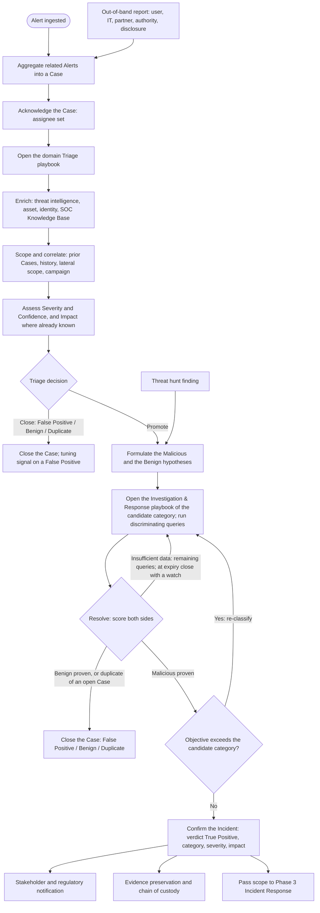

<!-- generated from zerosoc-framework@5f4ab248e4e0 : 03-Processes/02-detection_and_analysis.md — do not edit; regenerate with tools/build_references.py -->

# Phase 2: Detection & Analysis

Once telemetry is flowing and detection logic is active (Phase 1), the Security Operations Center (SOC) must identify and analyze security-relevant events. This phase governs the process of moving from raw alerts to validated, scoped, and prioritized incidents.

The objective of this phase is to rapidly determine whether the activity is a genuine threat (True Positive), a detection error (False Positive) or authorized activity (Benign Positive), assess the scope of any malicious activity, and pass confirmed Incidents to Response for containment. Root cause analysis is explicitly excluded from the critical path of this phase to avoid delaying containment.

## Process Flowchart

---

## Phase 2 sub-phases

Phase 2 (Detection & Analysis) is executed in two sub-phases: **Phase 2.a — Triage** (alert-centric, low-effort, fast) and **Phase 2.b — Investigation** (hypothesis-centric, deep). The object of Triage is **Alerts**; the object of Investigation is the **hypothesis**. The split mirrors the two modes of human reasoning: Triage is **System 1** thinking — fast, pattern-based, low-cost, good at recognizing the familiar and discarding the obvious — and Investigation is **System 2** thinking — slow, deliberate, hypothesis-driven, reserved for what System 1 could not settle. Keeping them distinct keeps the fast path fast and gives the slow path only the Cases that deserve it.

## 1. Phase 2.a — Triage (Verification, Enrichment & Prioritization)

The triage process begins as soon as an Alert is triggered and a Case is opened. The goal is to quickly enrich the context and assign a severity score.

**Domain playbook selection.** Identify the alert's **telemetry domain** (Endpoint, Identity, Network, Cloud, Email, Data, Application, OT/ICS) and open the corresponding **triage playbook** under [`04-Playbooks/01-Triage/`](../04-Playbooks/01-Triage/). That playbook supplies the domain alert catalog, entity normalization & enrichment, and known false-positive conditions used in the steps below, and defines the Triage → Investigation phase transition contract it must populate (see [Playbook Architecture §5](../04-Playbooks/playbook_architecture.md)). The two-layer playbook model and the domain → Incident Category pivot are defined in [Playbook Architecture](../04-Playbooks/playbook_architecture.md).

### Inputs & Outputs

| | |
|---|---|
| **Consumes** | One or more **Security Alerts** (`Detection Finding [2004]`, `severity_id ≥ Low`) aggregated into a **Case** (`Incident Finding [2005]`); enrichment sources (threat intelligence, CMDB, identity directory, SOC knowledge base); the active-Cases store. **Signals** (Informational Detection Findings) do not trigger triage; they are consulted during it. |
| **Produces (exactly one)** | (a) a **Closed Case** — `verdict_id` False Positive (`1`), Benign (`5`) or Duplicate (`10`, §1.5); a False Positive additionally emits a tuning signal to [Phase 1](01-preparation_and_engineering.md); or (b) a **Case promoted to Investigation**, carrying the Triage → Investigation phase transition contract (field schema in [Playbook Architecture §5](../04-Playbooks/playbook_architecture.md)) and the Triage Note (§1.6). Triage does **not** confirm an Incident. |

### 1.1 Reception, Aggregation, and Assignment
1.  **Alert Registration & Aggregation:** An incoming Alert is registered in the queue. To reduce alert fatigue and provide broader visibility of the potential incident, SIEM, SOAR, or XDR tools may aggregate multiple related alerts (e.g., sharing common attributes like host, user, or threat actor) into a consolidated **Security Case**.
2.  **Deduplication & Throttling Rules:**
    *   *Active Case Correlation:* The triage system queries the active Cases database. If an open, unresolved Case exists for the same host, identity, or IP address, incoming alerts are automatically appended to that existing Case instead of spawning a new one.
    *   *Rate Throttling:* If the same alert type repeatedly triggers from a single source within a sliding window (e.g., 1 hour), the system consolidates them into a single summary signal and suppresses duplicate alerts.
3.  **Acknowledgment:** The Analyst (human, automation, or agent — see [Definitions §6](../01-Foundation/definitions.md#6-executors-and-functions)) acknowledges the Case (and its constituent alerts) and shifts its state to `In Progress`.
4.  **Review the Alert(s):** Read the detection logic and key fields and form a first impression before enrichment — do not skim. Identify what behavior triggered the alert and whether it plainly warrants deeper work, so the steps that follow are directed rather than exploratory. In case multiple alerts are aggregated in a Case by the SecOps tools try to understand the relationships between the alerts and the related entities. A case with multiple alerts of different types and mapping to multiple techniques has a higher probability of representing an incident compared to an alert with a single Low / Medium severity alert.
5.  **Watch the Case while it is open:** while triage and investigation are in progress, the SecOps tooling may append new alerts to the Case and, in some cases, change its severity or its affected assets. The executor re-reads the Case at each step and before the decision, so that no newly added activity is overlooked.

### 1.2 Multi-Vector Context Enrichment
Before performing deep-dive analysis, the alert must be enriched with critical business and environmental context:
*   **Threat Intelligence & Enrichment Capabilities:** Query indicators of compromise (IOCs) — public IPs, file hashes, domains, and URLs — against threat-intelligence and enrichment services to check reputation and known threat-actor affiliations. Use these capability classes, subject to the [Data-Handling & OSINT Egress Boundaries](../07-Governance/agentic_guardrails.md):
    *   **Multi-engine reputation lookup** for hashes, IPs, domains, and URLs — interpret the *number* of engines flagging an indicator, not a single verdict.
    *   **URL detonation / rendering** to inspect a suspicious link's behavior and content without visiting it directly. Detonation is a risky activity: perform it only in a controlled fashion on hardened, isolated sandbox systems, never from an analyst workstation or a production network.
    *   **Malware-sample / behavioral repository** lookup (by indicator) for family attribution and observed behavior.
    *   **Domain registration-age / WHOIS** — a newly-registered domain carries elevated risk.
    *   **Decoding / deobfuscation** of encoded command lines and payloads to reveal the underlying action.
*   **Asset Context:** Query the CMDB or asset inventory to retrieve:
    *   Asset business criticality (e.g., Crown Jewels, production system, dev/test).
    *   Network segment (e.g., external-facing DMZ, internal database zone).
    *   Operating system, patch level, and installed software.
*   **Identity Context:** Query directory services (e.g., Active Directory, LDAP, cloud IAM) to retrieve:
    *   User role, department, and geographic location.
    *   Privilege levels (e.g., Domain Admin, Billing Admin, standard employee).
    *   Active sessions and standard access hours.
*   **Organizational Context (SOC Knowledge Base):** Query the [SOC Knowledge Base](../01-Foundation/definitions.md#soc-knowledge-base-soc-kb) for what the CMDB and the directory do not know: VIP or high-risk status of the user, approved exceptions and known-benign activity for the entity, naming conventions that reveal an asset's role, network ranges, vulnerability scans or maintenance windows covering the alert time, and lessons learned from prior Incidents on the same entities.

### 1.3 Scope & Correlation Analysis
To understand if an alert is an isolated event or part of a wider campaign, the executor conducts:
*   **Prior Cases:** Query prior Cases for this alert type, host, or identity — the activity may already have been investigated and dispositioned, and a prior verdict with its documented reasons is valuable context. It is context, not a verdict: a Case is never closed because similar Cases were closed before. Read the prior Case's reasoning and verify that it applies to the details of this one; "similar" alerts differ in exactly the attributes that separate a benign recurrence from a new intrusion.
*   **Historical Correlation:** Query system execution, authentication, and network flow logs (typically the last 30 days) to determine if this specific asset or identity has exhibited similar anomalous patterns.
*   **Lateral Scope Analysis:** Pivot on shared parameters (such as source IP, admin credentials used, or file hashes) to check adjacent systems and shared cloud services for related activity, defining the initial blast radius.
*   **Campaign Check:** Query whether the same alert type or indicator cluster is firing across many entities in the current window. If so, aggregate the alerts into a single campaign-level Case and set `severity_id` for the campaign scope, not the single alert.

### 1.4 Case Classification: Severity, Confidence & Impact

Every Case carries three measures, defined level by level in [Definitions §7](../01-Foundation/definitions.md#7-classification-levels) and recorded in the [Case Schema](../02-Taxonomy/case_schema.md). Triage assigns them; Investigation refines them. Triage does not accept the alert's source `severity_id` at face value: it validates it and overrides it where context (asset criticality, identity privilege, blast radius) warrants.

#### A. Severity — "how bad" (OCSF `severity_id`)
**Informational (1) · Low (2) · Medium (3) · High (4) · Critical (5)**. Potential harm: the threat severity of the observed behavior combined with the criticality of what it touches. Sets the response deadlines.

#### B. Confidence — "how sure" (OCSF `confidence_id`)
**Low (1) · Medium (2) · High (3)**. The likelihood that the Malicious hypothesis is true. The same scale tags every finding (§1.6): the Case's confidence starts from its strongest alert's — or, when the tool gives none, from its severity (Informational/Low → Low, Medium → Medium, High/Critical → High) — and is set by the triage rule (§1.5) and the resolution rule (§2.4). Sets what may be acted on autonomously.

#### C. Impact — "how much harm" (OCSF `impact_id`)
**Low (1) · Medium (2) · High (3) · Critical (4)**. Realized or expected harm. Assessed at triage when already known — an external report stating the harm, or affected entities classified as critical assets or VIP users — and otherwise at incident confirmation (§3.1); **unknown** until then, never guessed. Sets what must be reported (§3.2).

There is no separate "priority" axis. Organizations running risk-based alerting MAY add an entity **risk score** as an extension.

### 1.5 Triage Decision

Triage ends in a decision: **Close** the Case (False Positive, Benign, or Duplicate) or **Promote** it to Investigation. There is no "escalate" outcome: stakeholder notification (§3.2) happens only after Investigation confirms an Incident, and a change of assignee (§2.3) is not a triage outcome.

**Evidence at triage.** Every finding is tagged with a **side** and a **confidence** — `Malicious (High)`, `Benign (Medium)`, … — or left untagged as context (§1.6). The alerts themselves are the first Malicious findings: each independent alert in the Case is tagged `Malicious` at the confidence its tool assigned, or at the level its severity maps to when the tool gives none. Alerts of the same type on the same entity count once. A `Benign (High)` finding is one that **explains** an alert on its own: an approved exception or documented change in the SOC Knowledge Base, an authorized test window covering the host and the time, a known-benign recurrence with the same parameters.

**The rule.** Close as False Positive or Benign only when both hold:

1. no Malicious finding exists beyond the alerts themselves;
2. the Benign findings **cover every alert** in the Case: an alert at High confidence is covered only by a `Benign (High)` finding; an alert at Low or Medium confidence by Benign findings whose weights (Low 1, Medium 2, High 3) sum to more than its own.

Otherwise promote — including when there is no finding at all: an alert that enrichment could neither explain nor corroborate is an unexplained alert, and Investigation, not Triage, resolves ambiguity. If a required data source was unavailable, that is a Visibility Gap (§1.6), recorded as such.

**Confidence leaving triage.** Start from the strongest alert's confidence; raise one level when the Case aggregates independent alerts of different types or techniques, or holds two or more independent Malicious findings beyond them; lower one level when Benign findings exist but do not close the Case. High at triage is legitimate and authorizes nothing by itself: autonomous action keys on the confidence Investigation resolves.

*   **Checklist — can I explain *why* this is suspicious?** If you cannot articulate, in one sentence and with evidence, why the activity is suspicious, you are missing context: gather more. Do not promote out of fear, and do not close prematurely to clear the queue.

> **Example — a Case that closes at triage.** Identity alert "OAuth app consent / token-session theft", tool confidence Medium → `Malicious (Medium)`, weight 2. Findings: the user is in Marketing (context); the consented app is on the sanctioned list in the SOC Knowledge Base, onboarded last week → `Benign (High)`, 3; the same consent is seen for six colleagues the same morning → `Benign (Medium)`, 2; the publisher domain is four years old with a clean reputation → `Benign (Low)`, 1. No Malicious finding beyond the alert; the Benign findings covering it sum to 6 > 2 (and one of them explains it outright). **Close as Benign Positive**, confidence High.
>
> **Example — a Case that promotes.** Endpoint alerts "Credential dumping" (tool confidence High → `Malicious (High)`, 3) and "Internal scan / lateral movement" (no confidence field, severity Medium → `Malicious (Medium)`, 2) on the same host. Findings: the host is a jump server used by administrators → `Benign (Low)`, 1; the knowledge base records an authorized penetration test this week whose scope does not include this host (context); the dumping process was launched from a scheduled task created two hours earlier → `Malicious (Medium)`, 2; the task creator is a service account that never created tasks before → `Malicious (Low)`, 1. A Malicious finding exists beyond the alerts and neither alert is covered. **Promote**; two independent techniques raise the confidence to High.

**Closing as Duplicate.** A Case is closed as Duplicate (`verdict_id` 10) — at triage or during investigation — when its activity, root cause and threat vector are already being handled by an open **master Case** (a tuning ticket submitted, an investigation or a response in progress) and the recurrence adds neither risk nor evidence to it. Because a wrongly closed duplicate is a missed threat, all of the following are validated first:

*   **Matching core entities:** the same primary identifiers — host, user, file hash, process, command line — as the master Case, not merely the same detection rule name.
*   **Overlapping timeline:** the activity falls in the master Case's time window and is a known step of its course of action (e.g., further beacons during an intrusion already under investigation).
*   **Active assignment:** the master Case has an assignee and is In Progress, or its tuning ticket is open.
*   **Evidence merged:** every new timestamp, event reference or indicator from the recurrence is linked or merged into the master Case before the duplicate is closed.

Do **not** close as Duplicate when the identical alert fires on a *different* host or user — that is scope expansion (possible lateral movement): add the entity to the master Case instead; when the recurrence comes long after the prior Case was resolved — treat it as possible re-infection, incomplete eradication or new compromise; or when the only similarity is the rule name. The Triage Note (§1.6) of a duplicate records the master Case identifier and the parameters that matched (e.g., "same host, user and file hash; part of the containment in progress"), so the lineage survives audit and post-incident review.

### 1.6 Triage Note

Every triage — whether performed by a human, automation, or an agent — produces a **Triage Note**, the concise decision record that travels with the Case and its phase transition contract. It is distinct from, and lighter than, the forensic **Evidence Preservation & Chain of Custody** record (§3.3), which is incident-grade and tamper-proof. A conformant Triage Note contains:

*   **Summary** — the alert, host, identity, and the core behavior that triggered it. The Summary and the Findings populate the Triage → Investigation phase transition contract, whose fields are listed once in [Playbook Architecture §5](../04-Playbooks/playbook_architecture.md#5-phase-transition-contracts).
*   **Actions Taken** — the logs and systems reviewed, the enrichment capabilities queried, and the internal records consulted.
*   **Findings** — entity context; entity and process analysis; threat-intelligence results; and the historical baseline (was this seen before, and how many of the prior Cases on the same entities or alert type were confirmed True Positive?). Every Finding that bears on a hypothesis carries a **side and a confidence** — `Malicious (High)`, `Benign (Medium)`, … (§1.5); Findings that are pure context (asset role, user department) carry none. Tagged Findings are evidence: they seed the Investigation score (§2.4) and are verified, not re-collected, after promotion.
*   **Decision & Justification** — the verdict (Close or Promote) with a one-to-two-sentence, evidence-cited rationale.
*   **References** — links to the queries, indicators, and internal records used. MUST also include resolvable references to the specific supporting events — OCSF finding/event identifiers (e.g. Detection Finding `finding_uid`) or platform event links — that ground each Finding; a Finding without a traceable event reference is not conformant.
*   **Visibility Gaps** — every `required_data_sources` entry ([Playbook Architecture §7](../04-Playbooks/playbook_architecture.md#7-execution)) unavailable during triage, each paired with the check it prevented; write "None." when no gap occurred. The countable source for [Visibility-Gap Rate](../05-Metrics/operational_metrics.md).
*   **Provenance** — the playbook(s) used (path plus its `last_updated` date as version), the executor (human / automation / agent — list all classes that materially contributed, e.g. `automation + agent`), the capability classes invoked, and the case/incident ID(s). Required for Glass Box auditability ([Agentic Guardrails](../07-Governance/agentic_guardrails.md)).

Notes must be specific and concise: state findings in accurate terms rather than vague language, and summarize evidence rather than pasting raw logs — event references are IDs/links, never raw-log dumps. Whenever ATT&CK/ATLAS technique codes appear in a Note, they are written as `ID (Name)` (e.g. `T1114.003 (Email Forwarding Rule)`), never bare codes.

---

## 2. Phase 2.b — Investigation

Investigation is driven by testing competing hypotheses rather than unstructured searching. It executes the Investigation & Response playbooks under [`04-Playbooks/02-Investigation-Response/`](../04-Playbooks/02-Investigation-Response/), selected by candidate Incident Category (the domain → Incident Category pivot of the [Playbook Architecture](../04-Playbooks/playbook_architecture.md)).

### Inputs & Outputs

| | |
|---|---|
| **Consumes** | The promoted Case, its Triage → Investigation phase transition contract, and its Triage Note (§1.6). The Note's tagged Findings — the enrichment of §1.2 and the scope and correlation results of §1.3 — are the starting evidence of the investigation and seed its score (§2.4); they are verified and extended, not re-collected. The Note also carries the reason the Case could not close: the Malicious findings beyond the alerts, and the Benign findings they were weighed against — the conflict Investigation starts from. |
| **Produces (exactly one)** | (a) a **Closed Case** — Benign hypothesis proven, `verdict_id` False Positive (`1`) or Benign (`5`) (a False Positive emits a tuning ticket to [Phase 1](01-preparation_and_engineering.md)); or (b) a **Confirmed Incident** — Malicious hypothesis proven — by setting `verdict_id = 2` (True Positive), assigning the definitive Incident Category, severity and impact, and the timeline, and emitting the Investigation → Response phase transition contract (field schema in [Playbook Architecture §5](../04-Playbooks/playbook_architecture.md)). Stakeholder and regulatory notification (§3.2) is triggered after confirmation; a change of assignee (§2.3) is a within-phase control. |

### 2.1 Concurrent Malicious/Benign Hypothesis Formulation
The executor formulates two competing narratives based on the observed behaviors and MITRE ATT&CK techniques:
*   **Malicious hypothesis (True Positive):** The telemetry indicates a threat actor performing unauthorized, malicious actions.
*   **Benign hypothesis (False Positive or Benign Positive):** The telemetry is explained by standard IT administration, developer testing, scheduled tasks, or expected user activities.

There are always exactly two sides. Competing explanations within a side — which Incident Category on the malicious side, which authorized activity on the benign side — are sub-hypotheses; the evidence they gather scores for their side (§2.4). The hypotheses as worded in the playbooks are indicative: the executor refines them to the Case.

### 2.2 Playbook Execution
1. **Verify the triage findings, starting from the conflict** that promoted the Case: confirm each tagged Finding (§1.6) or **retract** it when it does not hold or does not apply to this Case, and aim the first discriminating queries at the findings that conflict.
2. Apply the **domain → Incident Category pivot**: using the candidate `incident_category` from the Triage → Investigation phase transition contract, open the matching Investigation & Response playbook in [`04-Playbooks/02-Investigation-Response/`](../04-Playbooks/02-Investigation-Response/); if no specialized playbook exists, use the catch-all `00-generic.md`. (Contract fields per [Playbook Architecture §5](../04-Playbooks/playbook_architecture.md).) The technique lists in the playbooks and alert types are indicative, not exhaustive: the relation between techniques and Incident Categories is intentionally loose, and a category is decided by the adversary's objective and impact, not by technique lookup.
3. Execute the validation queries. The playbook's queries are **indicative, non-exhaustive examples** of the discriminating evidence that has worked for that category: the executor chooses the applicable ones and adds any step their experience warrants; every query run, listed or added, is recorded in the Investigation Note with its tag (§2.5). Queries must be **discriminating** and state the reading of both outcomes, so that a negative result is evidence too — a clean hash is a `Benign` finding, not silence. Seek evidence against the favoured hypothesis, not only for it.
4. Resolve per §2.4, then act on the outcome: a proven Malicious hypothesis promotes the Case to a confirmed Incident (§3.1); a proven Benign hypothesis closes the Case (a False Positive submits a tuning ticket to [Phase 1: Preparation & Engineering](01-preparation_and_engineering.md)).
5. **Re-classify on evidence drift:** if evidence reveals the activity's objective differs from, or exceeds, the current candidate Incident Category (e.g. a commodity loader staging ransomware, or phishing that yielded credentials), update the candidate `incident_category`, switch to the matching Investigation & Response playbook, and carry all accumulated evidence forward. Record the pivot, and its reason, in the Investigation Note (§2.5). The classification remains provisional until `verdict_id = 2` is set at incident promotion (§3.1).

### 2.3 Case Assignment
Every Case has one **assignee** (OCSF `assignee`): the executor responsible for advancing it and for its verdict. A change of assignee is a [handover](../01-Foundation/definitions.md#handover). The conditions under which the assignee must be a human — accountability for Crown Jewel assets and privileged identities — and the metering of automation and agents (investigation timebox, token budget) are specified in [Agentic Guardrails](../07-Governance/agentic_guardrails.md); this process applies the same resolution rule (§2.4) whoever the assignee is. A handover does not block the containment actions that [Incident Response §2.1](03-response.md#21-risk-based-autonomy-matrix-for-containment) pre-authorizes.

### 2.4 Hypothesis Resolution, Verdict and Confidence

Every finding — an alert, a tagged Triage Note Finding (§1.6) or a query result — carries a **side** and a **confidence**: `Malicious (Low | Medium | High)` or `Benign (Low | Medium | High)`. Playbook query tags MUST use exactly this vocabulary. The levels are the framework's confidence levels ([Definitions §7](../01-Foundation/definitions.md#7-classification-levels)): **Low** (weight 1) — consistent with the side, explainable otherwise; **Medium** (2) — corroborates the side, not conclusive alone; **High** (3) — sufficient on its own; on the Benign side, a finding that explains the alert.

**Score and retraction.** Each side scores the sum of its findings' weights, triage and investigation together. Findings derived from the same underlying telemetry artifact count once — a triage lookup and an investigation lookup on the same indicator are one finding. A query result that refutes a finding **retracts** it: its tag is removed, the score recomputed, and the retraction with its reason recorded in the Note. A result that indicates the other side is tagged on that side at the confidence it deserves.

**Resolution.**

1. **Malicious is proven** when its score, after retractions, is **3 or more**.
2. **Benign is proven** when its score is **3 or more** *and* its explanation **covers every Medium and High confidence Malicious finding** — each is either retracted or accounted for by the explanation. Uncovered Low-confidence Malicious findings never block a Benign verdict; they lower its confidence one level and are listed in the Note as residual observations, which the monitoring watch covers.
3. **Verdict and confidence:**

| Outcome | Verdict (`verdict_id`) | Confidence (`confidence_id`) | Next step |
|---|---|---|---|
| Benign proven | False Positive (`1`) if the detection was wrong; Benign Positive (`5`) if the activity was authorized | the highest confidence on the Benign side, minus one level for residual Low-confidence Malicious findings | Close; a False Positive emits a tuning ticket to Phase 1; a Low-confidence close carries a monitoring watch and is flagged for QA sampling |
| Malicious proven (and Benign not) | True Positive (`2`) | the highest confidence on the Malicious side | Promote to Incident (§3.1); response autonomy keys on this confidence — at Low, every containment action requires approval per [Incident Response §2.1](03-response.md#21-risk-based-autonomy-matrix-for-containment) |
| The activity is already handled by an open master Case (§1.5 duplicate criteria met) | Duplicate (`10`) | — | Close; evidence merged into the master Case |
| Neither proven | none — **insufficient data** | — | Run the remaining discriminating queries, listed or added; when the investigation timebox or budget expires ([Agentic Guardrails](../07-Governance/agentic_guardrails.md)), apply this rule to the evidence at hand and, if still neither, close as Insufficient Data (`7`) with a monitoring watch (re-open on recurrence of the entities; active monitoring for the retention window at High/Critical severity) and a visibility or tuning ticket |

Because Benign proof requires coverage, the two sides cannot both be proven: an explanation that leaves a Medium or High Malicious finding standing is incomplete, and the Malicious verdict holds until a query retracts that finding or the explanation grows to cover it.

> **Example — retraction flips the verdict.** A user-reported phishing alert, tool confidence Medium → `Malicious (Medium)`, 2. Triage found: sender domain registered three days ago → `Malicious (Medium)`, 2; the link is a credential-harvesting page per detonation → `Malicious (High)`, 3; the SOC Knowledge Base lists a running phishing-awareness campaign by the training vendor → `Benign (High)`, 3. Malicious 7, Benign 3 — promoted, because Malicious findings exist beyond the alert. Investigation starts from the conflict: the vendor confirms the message is theirs and the harvesting page is their mock-up. That **retracts** the harvesting-page and young-domain findings, which belong to the simulation. Malicious is back to the alert alone, 2; Benign 3 covers it (the only remaining Medium/High Malicious finding is the alert, explained by the campaign). **Benign proven → Benign Positive, confidence High.**
>
> **Example — coverage decides, no arbitration needed.** Credential-dumping alert, tool confidence High → `Malicious (High)`, 3. Investigation: the credential was used from a new host forty minutes later → `Malicious (High)`, 3; the process that read LSASS is the backup agent's signed binary, which does so by design on every host → `Benign (High)`, 3. Malicious 6, Benign 3, but the Benign explanation covers only the alert, not the later credential use: **Benign is not proven; Malicious is** — True Positive, High. The playbook's next query asks whether that use was the agent's own authentication to the backup target. If it was, the finding is retracted, the explanation now covers everything, and the verdict is **Benign Positive, High**. If it was not, the Incident stands.
>
> **Example — confidence is the strongest finding, not an average.** C2-beaconing alert, Medium → `Malicious (Medium)`, 2. Investigation: the destination is an active C2 server on a threat-intelligence feed → `Malicious (High)`, 3; the beacon interval is regular to the second → `Malicious (Low)`, 1; the process is unsigned → `Malicious (Low)`, 1; first contact at 02:14 → `Malicious (Low)`, 1. Malicious 8, Benign 0: **True Positive, confidence High** — the feed hit is sufficient on its own. An average (1.6) would have said Medium and denied the pre-authorized containment a confirmed C2 destination warrants; the three Low findings describe the intrusion, they do not dilute it.
>
> **Example — a Low-confidence verdict is acted on, not escalated.** New cloud access key, tool confidence Low → `Malicious (Low)`, 1. Investigation adds: created outside change windows → `Malicious (Low)`, 1; by a principal that never created keys → `Malicious (Low)`, 1; used from a region the account never used → `Malicious (Low)`, 1. Malicious 4, Benign 0: **True Positive at Low confidence.** The Incident is declared and passed to Response, where at Low confidence every containment action — even revoking the key — requires approval under the autonomy matrix. The remaining queries, or the response itself, raise the confidence or retract the findings.

### 2.5 Investigation Note (Verdict Evidence Record)

Every Investigation — whether performed by a human, automation, or an agent — produces an **Investigation Note** on Investigation close or incident promotion, symmetric to the Triage Note (§1.6) but scoped to the deep-dive. A conformant Investigation Note contains:

*   **Classification & Assessment** — the confirmed (or, on close, the last candidate) Incident Category, the assessed `severity_id`, `confidence_id` and, for a confirmed Incident, the assessed impact (§3.1).
*   **Executed Queries** — the validation queries run, each with its outcome and its side-and-confidence tag (§2.4).
*   **Resolution Rationale** — the §2.4 resolution applied: the score of each side, the side proven and the findings that carry it, the findings retracted and why, and the resulting confidence.
*   **Re-classification Pivots** — any candidate `incident_category` change (§2.2), with the reason and the evidence that triggered it.
*   **Case Timeline** — a chronological reconstruction of the case: the attacker's course of action (initial access → progression → objective, where established) interleaved with the detection and response actions taken, each entry timestamped (UTC) and citing its supporting event reference. The earliest **confirmed malicious** event in the timeline is the case's **T0** — the anchor for MTTD/MTTC/MTTR ([Operational Metrics §4](../05-Metrics/operational_metrics.md)) and for the Phase 4 reconstruction ([Post-Incident Activity](04-post_incident_activity.md)). This element satisfies the Investigation → Response phase transition contract's `timeline` field ([Playbook Architecture §5](../04-Playbooks/playbook_architecture.md)). A Case that closes without Malicious hypothesis being proven still carries a Case Timeline (it documents the case, not only the attack) but carries no T0, since no malicious event was confirmed.
*   **Evidence References** — links to the preserved evidence (§3.3). MUST also cite, by OCSF identifier/link, the underlying event(s) grounding each material finding — the same event-evidence discipline as the Triage Note (§1.6).
*   **Visibility Gaps** — every `required_data_sources` entry ([Playbook Architecture §7](../04-Playbooks/playbook_architecture.md#7-execution)) unavailable during investigation, each paired with the check it prevented; write "None." when no gap occurred. The countable source for [Visibility-Gap Rate](../05-Metrics/operational_metrics.md).
*   **Provenance** — the playbook(s) used (path plus its `last_updated` date as version), the executor (human / automation / agent — list all classes that materially contributed, e.g. `automation + agent`), the capability classes invoked, and the case/incident ID(s). Required for Glass Box auditability ([Agentic Guardrails](../07-Governance/agentic_guardrails.md)).

The Investigation Note is the machine-reviewable record consumed by QA sampling ([Agentic Supervision](../07-Governance/agentic_supervision.md)) and by post-incident review (Phase 4). As in the Triage Note, ATT&CK/ATLAS technique codes are always written as `ID (Name)` (e.g. `T1114.003 (Email Forwarding Rule)`), never bare codes.

---

## 3. Incident Declaration & Notification

The promotion of a Case to an Incident is a formal event that triggers technical, management, and regulatory communication channels.

### 3.1 Incident Promotion
The moment Malicious hypothesis is proven:
1. Promote the Case to an active **Incident** by setting its `Incident Finding` **`verdict_id = 2` (True Positive)** — the confirmation step that distinguishes an Incident from a Case (see [Definitions](../01-Foundation/definitions.md)).
2. Assign the definitive [Incident Category](../02-Taxonomy/incident_categories.md), record the observed MITRE ATT&CK tactics and techniques, and carry forward the timeline: promotion's `scope/impact/timeline` output (§2, Inputs & Outputs) *is* the Investigation Note's **Case Timeline** (§2.5); its earliest **confirmed malicious** event is recorded as **T0**, the anchor for MTTD/MTTC/MTTR ([Operational Metrics §4](../05-Metrics/operational_metrics.md)).
3. **Confirm or assess Impact and regulatory significance:** confirm the Impact recorded at triage, or assess it now — `impact_id` (Low / Medium / High / Critical) as the realized or expected harm to operations, data and third parties; determine whether the Incident is **significant** under NIS2 Article 23(3) — it caused or can cause severe operational disruption or financial loss, or considerable material or non-material damage to other persons — and whether it has **cross-border** effect. For financial entities, DORA's classification criteria (clients and counterparts affected, duration, geographic spread, data losses, criticality of the services, economic impact) inform the same assessment. These are fields of the [Case Schema](../02-Taxonomy/case_schema.md) and drive §3.2.
4. **Retrospective entity sweep:** query Cases closed as False Positive or Benign within the lookback window (default 90 days) that share the incident's entities. Every match is a candidate **verdict false negative** — flag it for mandatory QA review ([Agentic Supervision §2](../07-Governance/agentic_supervision.md)); confirmed misses are adjudicated in the Post-Incident Review ([Phase 4 §3](04-post_incident_activity.md)). Candidate matches are never silently dismissed.
5. Pass the initial scope (blast radius) directly to [Phase 3: Incident Response](03-response.md) for immediate containment.

### 3.2 Stakeholder & Regulatory Notification
Notification is the responsibility of the [SOC Manager](../01-Foundation/definitions.md#6-executors-and-functions) and keyed on the Incident's severity and impact (§3.1).

**Internal notification, by severity** (reference response times; the values are an organization policy knob):
*   **Low / Medium:** incident ticket to the affected asset owners; no out-of-hours notification.
*   **High:** notify the affected asset owners and the security lead within 30 minutes.
*   **Critical:** notify the CISO, legal counsel, risk management and executive leadership within 15 minutes.

**Regulatory notification** applies when the Incident is **significant** (§3.1) and the organization is in scope of the regulation. Deadlines run from awareness of the Incident; the reporting procedure and the content of each report are specified in [Incident Response §6](03-response.md#6-regulatory-reporting-nis2--dora):
*   **NIS2 (Article 23):** early warning within **24 hours** (whether the Incident is suspected to be malicious or unlawful, and whether it has cross-border effect); incident notification within **72 hours** with the initial assessment of severity and impact and the indicators of compromise; final report within **one month**.
*   **DORA (Article 19):** initial notification, intermediate report and final report on the deadlines of the regulation, with the classification of the Incident as major.

The recipient of these notifications is the national CSIRT or the competent authority designated by the regulation; the framework uses the term CSIRT in that sense only.

### 3.3 Evidence Preservation & Chain of Custody
All data collected during triage and investigation must be preserved to support subsequent forensics, root cause analysis, or legal prosecution:
*   Maintain a timestamped audit trail of all commands run, scripts executed, and queries submitted.
*   Preserve volatile evidence (e.g., memory captures, active network sessions, process lists) using non-destructive gathering scripts.
*   Store all evidence, screenshots, and logs in a secure, write-once, tamper-proof incident ledger.

---

## 4. Threat Hunting

Threat Hunting is a proactive sub-process that runs in parallel with continuous monitoring to detect adversaries that have bypassed automated rules.

### 4.1 Sprint-Based Cadence
Threat hunting is conducted in structured sprints at a cadence defined by the organization (bi-weekly recommended). Each hunt must target a specific hypothesis rather than generalized log parsing.

### 4.2 Hypothesis Generation
Hunt hypotheses are generated from:
*   **Threat Intelligence:** Newly published MITRE ATT&CK TTPs or threat group profiles.
*   **Vulnerability Disclosures:** Supply chain concerns or newly discovered software flaws.
*   **Crown Jewels Review:** Proactive baselining and verification of access logs to the company's most critical assets.

### 4.3 Pipeline Integration
If a threat hunt uncovers signs of malicious activity:
1. Immediately generate a high-priority Alert.
2. Formulate a Case and ingest it directly into **Investigation** (§2) for immediate validation, prioritization, and response. A hunt-found incident is, by definition, a detection false negative — its Alert was registered by the hunt, not produced by Phase-1 detection content — and feeds the recall metrics in [Operational Metrics §5.5](../05-Metrics/operational_metrics.md).

---

## 5. Out-of-Band Incident Intake

Detection does not only fail loudly; it also fails silently. Suspected incidents surface outside the alert pipeline: a user report, an IT anomaly ticket, a partner / CERT / law-enforcement notification, a vendor breach disclosure, or activity stumbled upon during an unrelated investigation. Each of these is a potential **detection false negative**. The framework treats their intake as a first-class Phase 2 entry point — not an ad-hoc side channel — so that misses are investigated with the same rigor as alerts and measured honestly ([Operational Metrics §5.5](../05-Metrics/operational_metrics.md)).

1. **Register:** create an Alert (`Detection Finding [2004]`, severity per initial assessment) and aggregate it into a Case per §1.1. Out-of-band reports run the standard triage → investigation pipeline and produce the same Notes and deliverables — no shadow process. Because the Alert is registered by this intake step rather than produced by Phase-1 detection content, the discovery channel is evident from the Case itself; no additional marking is required ([Operational Metrics §5.5](../05-Metrics/operational_metrics.md)).
2. **Evaluate & attribute:** triage and investigate per §1–§2. If the Case is confirmed as an Incident, it is a **confirmed detection false negative**: the Post-Incident Review MUST perform the missed-detection analysis ([Phase 4 §3](04-post_incident_activity.md)), converting the miss into detection requirements rather than just a closed ticket.
