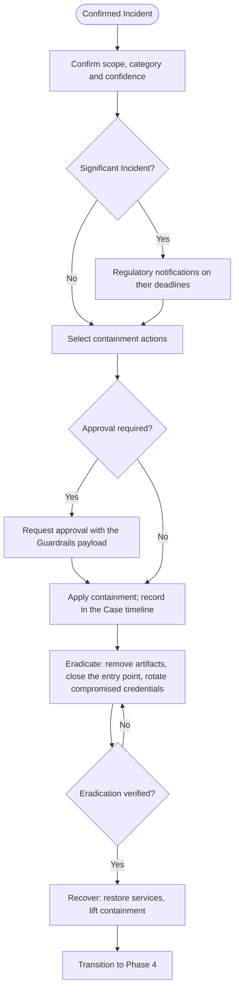

<!-- generated from zerosoc-framework@a5ef27cbdbd7 : 03-Processes/03-response.md — do not edit; regenerate with tools/build_references.py -->

# Phase 3: Incident Response

A Case enters this phase when [Phase 2: Detection & Analysis](02-detection_and_analysis.md) has proven the Malicious hypothesis and confirmed the Case as an **Incident** (`verdict_id = 2`). Incident Response contains the threat, eradicates it and restores operations. It is aligned to NIST SP 800-61 Rev. 3 (Table 3, Respond and Recover) and ISO/IEC 27035 (Respond).

The Case [assignee](../01-Foundation/definitions.md#6-executors-and-functions) carries the Incident through this phase: the framework has no separate response function or incident commander, and every step below is executable by a human analyst, deterministic automation or an agent alike. What differs by executor is not the process but the **approval** some actions require (§2.1), which the [Agentic Guardrails](../07-Governance/agentic_guardrails.md) govern.

## Inputs & Outputs

| | |
|---|---|
| **Consumes** | A **Confirmed Incident** with its Investigation → Response [phase transition contract](../01-Foundation/definitions.md#phase-transition-contract): confirmed Incident Category, scope (affected entities), timeline with T0, severity, confidence, impact, the significance and cross-border flags, and the recommended containment, eradication and recovery actions (field schema in [Playbook Architecture §5](../04-Playbooks/playbook_architecture.md#5-phase-transition-contracts)). |
| **Produces** | A contained, eradicated and recovered environment (services restored, containment lifted); every response action appended to the Case timeline ([Case Schema](../02-Taxonomy/case_schema.md)); the regulatory notifications the Incident requires (§6); and the transition to [Phase 4: Post-Incident Activity](04-post_incident_activity.md) (§5). |

## Process Flowchart

## 1. Scope Confirmation

The Incident arrives confirmed; this step confirms what the response acts on. From the phase transition contract, the executor:

1. Confirms the **scope**: the affected entities (identities, assets, network locations, artifacts) and the confirmed [Incident Category](../02-Taxonomy/incident_categories.md), whose Investigation & Response playbook lists the containment, eradication and recovery actions for that kind of Incident.
2. Reads the Case **confidence** resolved by Investigation ([Detection & Analysis §2.4](02-detection_and_analysis.md#24-hypothesis-resolution-verdict-and-confidence)) and the Case **severity**: together with the criticality of the affected entities, they decide which containment actions can be applied without approval (§2.1).
3. Checks whether any affected entity is a Crown Jewel asset or a privileged identity. If so and the assignee is not human, the [handover](../01-Foundation/definitions.md#handover) the Guardrails require happens now; it does not delay the pre-authorized containment of §2.1.

Scope expands during the response as containment and eradication reveal further affected entities: every expansion is recorded in the Case timeline, and the containment actions are re-selected for the new entities.

## 2. Containment

Containment stops the threat from causing further damage while the Incident is eradicated. The executor selects the containment actions from the playbook of the confirmed Incident Category and applies them under the autonomy matrix below. Every containment action is recorded in the Case timeline with its timestamp, the entity it acted on and how it is reversed.

### 2.1 Risk-Based Autonomy Matrix for Containment

The matrix decides, for each containment action, whether the executor applies it directly or requests approval first. It keys on three things: the **reversibility** of the action, the **criticality** of the entity it acts on, and the Case **confidence** and **severity**. It is the single authority on containment autonomy in the framework: the Guardrails define how approval is requested and who grants it, and the playbooks list the actions of each Incident Category.

**Pre-authorized actions** are reversible and leave the affected entity's service running. Any executor applies them without approval, on any entity — a Crown Jewel included — and records the action and its rollback in the Case timeline:

*   isolating an end-user workstation from the network (reversed by reconnecting it);
*   suspending the active sessions of an identity, or disabling an identity no critical service runs under (reversed by re-enabling it);
*   revoking a specific API key, token or certificate (reversed by issuing a new one);
*   applying a temporary egress block, or blocking an external IP address or domain at the perimeter (reversed by removing the rule);
*   quarantining a file or an email message (reversed by releasing it).

**Actions requiring approval** stop a critical service, are not reversible, or affect many entities at once. The executor requests approval before applying them and records the approval in the Case timeline:

*   any action that stops a Crown Jewel asset from serving: shutting down or isolating a production server, database or domain controller, disabling a service identity a critical service runs under;
*   isolating an entire subnet, VLAN or cloud network, or modifying its routing;
*   resetting the credentials of many identities at once;
*   blocklisting a partner or customer network;
*   wiping, re-imaging or deleting systems, disks or data.

**Confidence and severity adjust the matrix:**

*   At **Low** confidence every containment action requires approval, including the pre-authorized ones: the Incident is confirmed, but on evidence that a single retracted finding could overturn ([Detection & Analysis §2.4](02-detection_and_analysis.md#24-hypothesis-resolution-verdict-and-confidence)).
*   At **High** and **Critical** severity the pre-authorized actions are applied immediately, before the internal notification of [Detection & Analysis §3.2](02-detection_and_analysis.md#32-stakeholder--regulatory-notification) completes: a threat with a credible path to material harm is stopped first; the notified stakeholders confirm the action afterwards or request its rollback.
*   At **Low** and **Medium** severity the pre-authorized actions may be scheduled with the affected asset owner when applying them at once would disrupt work; the schedule is recorded in the Case timeline.

**Approval** is requested with the presentation payload of [Agentic Guardrails §2](../07-Governance/agentic_guardrails.md#2-the-human-in-the-loop-hitl-presentation-payload) — context, evidence, blast radius, rollback — whoever the executor is: a human analyst requesting approval from the SOC Manager submits the same payload an agent does. Who grants approval is an organization policy knob; the SOC Manager is the default approver. The time spent waiting for approval is measured as dwell time, not as containment time ([Operational Metrics §4](../05-Metrics/operational_metrics.md)). While approval is pending the executor applies the pre-authorized actions the Incident allows and continues the investigation of the residual findings.

> **Example — pre-authorized action on a Crown Jewel.** A confirmed credential-theft Incident at High confidence, High severity: an administrator's account authenticated to a domain controller from a host it never used. Disabling the administrator's account and revoking its sessions is pre-authorized, although the domain controller is a Crown Jewel: the account is a personal identity, no service runs under it, and the domain controller keeps serving. Isolating the domain controller itself is not pre-authorized; if the timeline shows the attacker executed code on it, the executor requests approval for the isolation while the account is already disabled.
>
> **Example — Low confidence changes the matrix.** A confirmed Incident at Low confidence: a new cloud access key created outside change windows and used from an unfamiliar region, with no finding above Low. Revoking the key is a pre-authorized action at Medium or High confidence; at Low confidence it requires approval, requested with the Guardrails payload and, in the meantime, the executor runs the remaining playbook queries: a single additional finding — the key downloading a storage bucket — raises the confidence to Medium and the revocation proceeds without approval.

---

## 3. Eradication

Eradication removes the threat actor and every foothold from the environment. The executor:

*   **Verifies containment first:** confirms, from the telemetry of the affected entities, that the contained activity has stopped — no lateral movement from the isolated hosts, no traffic to the blocked command-and-control infrastructure, no successful authentication by the disabled identities. Containment that has not held is corrected before eradication starts.
*   **Removes artifacts and persistence:** deletes malicious files and scripts, terminates rogue processes, and removes the persistence mechanisms the timeline identified (scheduled tasks, registry entries, services, web shells, mailbox rules, added credentials or OAuth grants).
*   **Closes the entry point:** patches the exploited vulnerability or corrects the configuration that allowed the initial access, so that the same path cannot be reused before recovery.
*   **Rotates compromised credentials:** resets the credentials of the identities the Case timeline confirms as compromised or exposed, and of the secrets those identities could reach. A reset broader than the confirmed scope is an action requiring approval (§2.1).

Each eradication action is recorded in the Case timeline; a foothold found during eradication that the investigation had not identified expands the scope (§1).

---

## 4. Recovery

Recovery restores operations to a verified clean state:

*   **Verification:** monitoring of the affected entities shows no indicator of compromise for a defined window (24 hours of normal operation as the reference value; an organization policy knob) before containment is lifted.
*   **System restoration:** systems are re-imaged from known-good templates or restored from verified backups taken before T0; restored data is checked for the artifacts eradicated in §3.
*   **Lifting containment:** egress blocks, network isolation and identity suspensions are removed gradually, each removal recorded in the Case timeline, with the detections that fired for the Incident kept active on the restored entities.

---

## 5. Transition to Phase 4

The response ends when containment has been lifted and the affected services are restored. The Case, with its timeline of detection and response actions, its Notes and its metrics (T0, MTTD, MTTC, MTTR per [Operational Metrics §4](../05-Metrics/operational_metrics.md)), is what [Phase 4: Post-Incident Activity](04-post_incident_activity.md) consumes. The framework does not yet define a separate Incident Record deliverable: the Case as the [Case Schema](../02-Taxonomy/case_schema.md) defines it, together with the Investigation Note, is the record of the Incident.

---

## 6. Regulatory Reporting (NIS2 & DORA)

Regulatory reporting applies when the Incident is **significant** and the organization is in scope of the regulation. Whether the Incident is significant, and whether it has cross-border effect, is assessed at confirmation ([Detection & Analysis §3.1](02-detection_and_analysis.md#31-incident-promotion)) and recorded in the Case (`significant`, `cross_border`); the notification is triggered there ([§3.2](02-detection_and_analysis.md#32-stakeholder--regulatory-notification)) and owned by the SOC Manager. This section specifies the reports. Deadlines run from the moment the organization becomes aware of the Incident, which is at the latest its confirmation; the response does not wait for a report, and a report does not wait for the response to end.

The recipient is the national CSIRT or the competent authority the regulation designates; the reporting channel and the legal review of each report are organization policy.

### 6.1 NIS2 (Article 23)

*   **Early warning, within 24 hours:** whether the Incident is suspected to be caused by unlawful or malicious acts, and whether it could have cross-border effect. It states what is known at the time; it is not an assessment.
*   **Incident notification, within 72 hours:** an update of the early warning with the initial assessment of the Incident's severity and impact, and the indicators of compromise available.
*   **Intermediate report, on request:** a status update when the competent authority or the CSIRT asks for one.
*   **Final report, within one month of the incident notification:** a detailed description of the Incident, its severity and impact, the type of threat or root cause that likely triggered it, the mitigation applied and, where applicable, the cross-border impact. When the Incident is still ongoing at that time, a progress report is submitted instead and the final report follows within one month of the Incident being handled.

### 6.2 DORA (Article 19)

For financial entities, a **major** ICT-related Incident (classified per the criteria of Article 18, recorded in the Case as `significant`) is reported in three steps, on the deadlines the regulation and its technical standards set:

*   **Initial notification:** the classification of the Incident as major and its known characteristics, within the hours of classification the standards specify.
*   **Intermediate report:** the status of the Incident and the changes since the initial notification, and whenever the status changes materially.
*   **Final report:** the root cause analysis and the actions taken, once the Incident is handled.

The reports draw on the Case: the timeline and T0, the affected entities and their criticality, the impact and its assessment, and the containment, eradication and recovery actions recorded in this phase.
