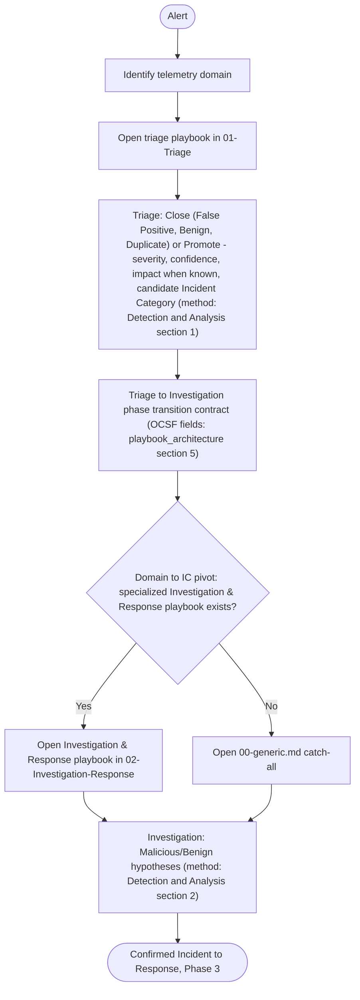

<!-- generated from zerosoc-framework@bba85278b26a : 04-Playbooks/README.md — do not edit; regenerate with tools/build_references.py -->

# Playbook Operating Guide (Start Here)

> **Draft.** The playbook module is published for review; see the [Playbook Architecture](playbook_architecture.md) for what is fixed and what is indicative.

This is the **operational entry-point** to the ZeroSOC playbook system for practitioners — human analysts, deterministic automation, and runtime agents. It routes any alert through the framework. It is **pure navigation**: the *method* (how to triage, investigate, respond) lives in [03-Processes](../03-Processes/00-detection_and_response_lifecycle.md); the *standard* governing playbook structure lives in [playbook_architecture.md](playbook_architecture.md); the *knowledge* lives in the playbooks linked below.

## The operational path

## Step 1 — Triage: Domain to Triage playbook

Identify the alert's telemetry domain and open its triage playbook. The playbook provides the domain alert catalog and, per alert type, the entities to enrich, the checks and what each result is evidence of, and the False Positive and Benign conditions; the triage *method* it plugs into is [Detection & Analysis §1](../03-Processes/02-detection_and_analysis.md).

| Telemetry domain | Triage playbook |
|---|---|
| Endpoint (EDR, AV, process/file telemetry) | [01-Triage/endpoint.md](01-Triage/endpoint.md) |
| Identity (IdP, AD, IAM) | [01-Triage/identity.md](01-Triage/identity.md) |
| Network (firewall, IDS/IPS, NDR) | [01-Triage/network.md](01-Triage/network.md) |
| Cloud (CSP control plane, CSPM) | [01-Triage/cloud.md](01-Triage/cloud.md) |
| Email (secure email gateway) | [01-Triage/email.md](01-Triage/email.md) |
| Data (DLP, data-access) | [01-Triage/data.md](01-Triage/data.md) |
| Application (app/API, WAF) | [01-Triage/application.md](01-Triage/application.md) |
| OT/ICS | [01-Triage/ot-ics.md](01-Triage/ot-ics.md) |

Triage output is the **Triage → Investigation phase transition contract** defined in [Playbook Architecture §5](playbook_architecture.md#5-phase-transition-contracts) — promoted Cases only, no verdict yet — a subset of the [Case Schema](../02-Taxonomy/case_schema.md).

## Step 2 — Investigation & Response: Incident Category to playbook

Using the candidate `incident_category` from triage (the **domain → IC pivot**), open the matching Investigation & Response playbook. Every Incident Category has a playbook; for activity that fits none, use the catch-all [00-generic.md](02-Investigation-Response/00-generic.md). The investigation *method* — verify or retract, score, coverage, verdict — is [Detection & Analysis §2](../03-Processes/02-detection_and_analysis.md).

| Incident Category | Investigation & Response playbook | Status |
|---|---|---|
| IC-01 Phishing / Social Engineering | [01-phishing.md](02-Investigation-Response/01-phishing.md) | draft |
| IC-02 Business Email Compromise | [02-bec.md](02-Investigation-Response/02-bec.md) | draft |
| IC-03 Ransomware & Digital Extortion | [03-ransomware.md](02-Investigation-Response/03-ransomware.md) | draft |
| IC-04 Denial of Service | [04-dos.md](02-Investigation-Response/04-dos.md) | draft |
| IC-05 Commodity Malware / Loader | [05-commodity_malware.md](02-Investigation-Response/05-commodity_malware.md) | draft |
| IC-06 Identity & Credential Attack | [06-identity_credential_attack.md](02-Investigation-Response/06-identity_credential_attack.md) | draft |
| IC-07 Web App Exploitation | [07-web_app_exploitation.md](02-Investigation-Response/07-web_app_exploitation.md) | draft |
| IC-08 Infrastructure Compromise | [08-infrastructure_compromise.md](02-Investigation-Response/08-infrastructure_compromise.md) | draft |
| IC-09 Insider Threat & Privilege Misuse | [09-insider_threat.md](02-Investigation-Response/09-insider_threat.md) | draft |
| IC-10 Supply-Chain Compromise | [10-supply_chain.md](02-Investigation-Response/10-supply_chain.md) | draft |
| IC-11 Data Breach / Exfiltration | [11-data_breach_exfiltration.md](02-Investigation-Response/11-data_breach_exfiltration.md) | draft |
| IC-12 Resource Hijacking / Cryptojacking | [12-resource_hijacking.md](02-Investigation-Response/12-resource_hijacking.md) | draft |
| IC-13 Destructive / Wiper Attack | [13-destructive_wiper.md](02-Investigation-Response/13-destructive_wiper.md) | draft |
| IC-14 OT/ICS Attack | [14-ot_ics.md](02-Investigation-Response/14-ot_ics.md) | draft |
| IC-15 AI/ML System Attack | [15-ai_ml_system.md](02-Investigation-Response/15-ai_ml_system.md) | draft |
| Catch-all (IC = ANY) | [00-generic.md](02-Investigation-Response/00-generic.md) | draft |

Incident Category definitions: [02-Taxonomy/incident_categories.md](../02-Taxonomy/incident_categories.md).

## References

*   Method (how): [Detection & Analysis](../03-Processes/02-detection_and_analysis.md), [Incident Response](../03-Processes/03-response.md).
*   Standard (structure): [Playbook Architecture](playbook_architecture.md).
*   Taxonomy: [Alert Types](../02-Taxonomy/alert_types.md), [Incident Categories](../02-Taxonomy/incident_categories.md).
